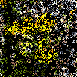
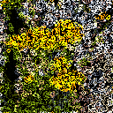
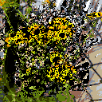
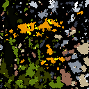
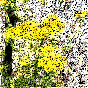

# Image-to-Game-of-Life-Replay

Turn an image into a cellular automaton animation, then **play it in reverse** to create an image reconstruction effect. 

The image is first reduced to a small set of colors and split into separate binary layers—one per color. Each layer evolves independently using a Game-of-Life–style rule, optionally with partial or noisy updates. The evolved layers are then recombined into full-color frames, producing animations that appear to organically assemble, dissolve, or glitch back into the original image. 

Built with an interactive Jupyter widget UI lets you experiment with rules, update modes, color counts, play speed, and export as a GIF.

---

## How it works 

1. **Upload an image**
2. **Resize** the image to a square grid 
3. **Quantize** the image into `N` palette colors
4. **Split** into `N` binary layers 
5. **Simulate each layer forward** with specified cellular automaton rule
6. **Reverse the history** so playback goes from “final” to “initial”
7. **Composite** layers into full-color RGB frames
8. **Preview** with Play/Slider controls and **export as GIF**

---

## Installation

    pip install numpy matplotlib pillow ipywidgets

---

## Update modes 

- `uniform`: all grid cells update each step 
- `patch`: a random rectangular block of cells updates each step 
- `noise_x`: random subset (x%) updates each step
- `noise_ramp`: per cell update probability ramps from ~5% to ~95% over time

---

## Update rules 

- **Conway**: B3/S23
- **HighLife**: B36/S23
- **Day & Night**: B3678/S34678
- **Maze**: B3/S12345
- **Seeds**: B2/S0 (explosive)
- **2x2**: B36/S125
- **Anneal**: B4678/S35678 (gradual morphing)

---

## Examples

<table>
  <tr>
    <th style="text-align:center;">Target</th>
    <th style="text-align:center;">Conway · Uniform</th>
    <th style="text-align:center;">Conway · Ramp</th>
  </tr>
  <tr>
    <td style="text-align:center;">
      
    </td>
    <td style="text-align:center;">
      
    </td>
    <td style="text-align:center;">
      
    </td>
  </tr>
</table>
<table>
  <tr>
    <th style="text-align:center;">Conway · Patch</th>
    <th style="text-align:center;">Anneal · Noise 50%</th>
    <th style="text-align:center;">Maze · Noise 50%</th>
  </tr>
  <tr>
    <td style="text-align:center;">
      
    </td>
    <td style="text-align:center;">
      
    </td>
    <td style="text-align:center;">
      
    </td>
  </tr>
</table>

